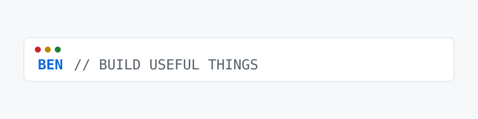

<h1 align="center">Benjamin Nasse</h1>

  Building practical AI-assisted tools, workflow automation, and data systems. CompTIA Security+ certified.

<picture>
  <source media="(prefers-color-scheme: dark)" srcset="./assets/terminal-dark.svg">
  <source media="(prefers-color-scheme: light)" srcset="./assets/terminal-light.svg">
  
</picture>

## Tech stack

## Selected work

- [SkillsUSA Nationals 2025](https://github.com/Bean0-0/SkillsUSA-Nats-2025) — 2025 national-competition project
- [TLi Strategy Tool](https://github.com/Bean0-0/tli-strategy-app) — a Flask app for disciplined position management, alerts, and Gmail-assisted parsing
- [Uber Hackathon](https://github.com/Bean0-0/UberHackathon) — Uber hackathon project 

<picture>
  <source media="(prefers-color-scheme: dark)" srcset="https://raw.githubusercontent.com/Bean0-0/Bean0-0/output/github-contribution-grid-snake-dark.svg">
  <source media="(prefers-color-scheme: light)" srcset="https://raw.githubusercontent.com/Bean0-0/Bean0-0/output/github-contribution-grid-snake.svg">
  
</picture>
